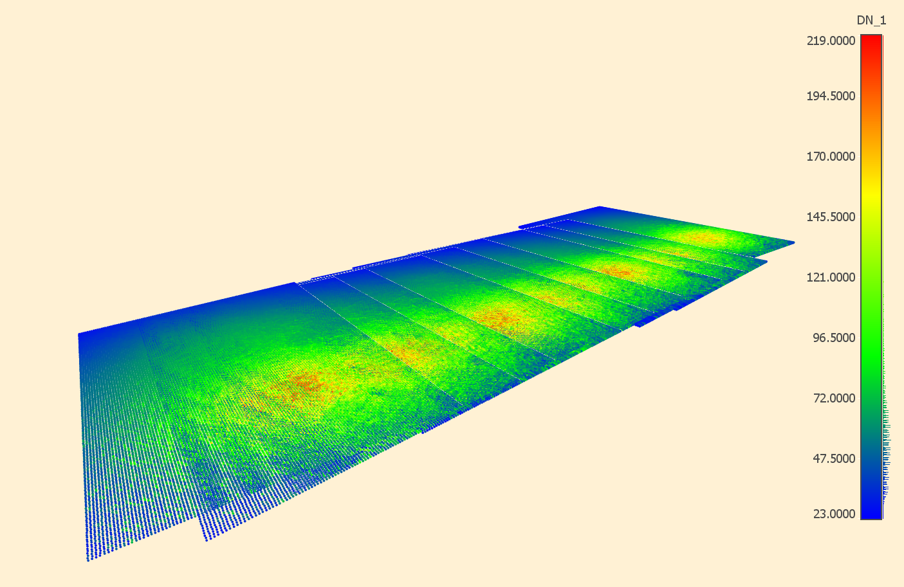

# hg-line-plane
Create a georeferenced point cloud from a photograph over an assumed horizontal surface.



## Overview
The MATLAB script developed here projects pixels from an image with known exterior orientation onto an objective plane of known elevation. If the focal length, format size, and the exterior orientation for a given photograph are known, then each pixel of that photograph can be represented as a line in real-world coordinates. This line passes from the perspective center of the camera through the pixel. The intersection of this line with an assumed horizontal plane can then be determined.

## How it works
### Determining the elevation of the water surface
The surface of a body of water for a local area can be assumed to be horizontal. The elevation $h$ of the surface can be determined, among other means, from SfM reconstruction of the scene through inspection of the reconstructed point cloud and photographic evidence.

### Determining the pixel line
First, an image coordinate system is defined with the objective lens at the origin. The image plane is defined as horizontal at negative focal length, $-f$. 

Row and column coordinates from an image are converted to $(x,y)$ with the origin at the principal point. A light ray from object space passing thru the image plane to the objective lens is represented as a line with direction $\vec{l'}=\langle x,y,-f \rangle$. This vector need not be normalized, nor is its directionality important, so long as the units are consistent. The simplest approach may be to use the units of pixels for ease of determining $x$ and $y$. Row and column coordinates—left-handed coordinates with an origin at the top left of the photograph’s format—can be converted to a right-hand $(x,y)$ coordinate pair with its origin at the center of the format as such:

$x=\text{row number}-\frac{\text{(number of rows)}}{2}$

$y=\text{column number}+\frac{\text{(number of columns)}}{2}$

The focal length of a camera can be converted to pixels if the camera’s pixel pitch (i.e., the dimensions of each pixel) is known. The focal length in pixels is also a common output of many SfM software applications.

The true direction of $\vec{l'}$ can be found by applying to it an active rotation as defined by the camera's exterior orientation. The rotation matrix $R$ by convention is a passive rotiation; the active rotation is $R^T$. The direction of $\vec{l'}$ in object space is thus given by $l=R^T\vec{l'}$.

### Homogeneous line-plane intersection
A line with direction $\vec{d}$ passing through a point $\vec{x}$ is represented homogeneously by six coordinates that describe its direction and moment, called Plucker coordinates: $L=(\vec{d};\vec{m})$ where $\vec{m}=\vec{d} \times \vec{x}$.

A plane with normal $\vec{n}$ passing through a point $r$ is represented homogeneously as $W=(\vec{n};ϵ)$ where $ϵ=-\vec{r} \cdot \vec{n}$.

The homogeneous point $P$ where $L$ intersects $W$ is found by 

$P=W_ \times L$   where    
```math
W_×=\begin{bmatrix} 𝜖𝟏 &\vec{n}_× \\ \vec{n}^T & 0 \end{bmatrix}
```
,

$n_×$ being the cross product matrix operator, a skew-symmetric matrix.

For the special case where the objective plane is horizontal with a known elevation $h$ (i.e., $z=h$),

```math
W_×=\begin{bmatrix}
    h & 0 & 0 & 0 & -1 & 0 \\
    0 & h & 0 & 1 & 0 & 0 \\
    0 & 0 & h & 0 & 0 & 0 \\
    0 & 0 & 1 & 0 & 0 & 0
\end{bmatrix}
```
## How to use
The script requires as input 
1. the path to the photos,
2. a control file with each photo's exterior orientation paramters (see [Control file](#control-file)),
3. the focal length of the camera (in units of pixels),
4. the elevation of the horizontal surface, and
5. a downsample coefficient.

### Control file
The control file layout expected is a CSV file from Agisoft Metashape, formatted as such:

```
# CoordinateSystem: PROJCS["WGS 84 / UTM zone 17N",GEOGCS["WGS 84",DATUM["World Geodetic System 1984 ensemble",SPHEROID["WGS 84",6378137,298.257223563,AUTHORITY["EPSG","7030"]],TOWGS84[0,0,0,0,0,0,0],AUTHORITY["EPSG","6326"]],PRIMEM["Greenwich",0,AUTHORITY["EPSG","8901"]],UNIT["degree",0.01745329251994328,AUTHORITY["EPSG","9102"]],AUTHORITY["EPSG","4326"]],PROJECTION["Transverse_Mercator",AUTHORITY["EPSG","9807"]],PARAMETER["latitude_of_origin",0],PARAMETER["central_meridian",-81],PARAMETER["scale_factor",0.9996],PARAMETER["false_easting",500000],PARAMETER["false_northing",0],UNIT["metre",1,AUTHORITY["EPSG","9001"]],AUTHORITY["EPSG","32617"]]
#Label,X/Easting,Y/Northing,Z/Altitude,Yaw,Pitch,Roll
1001.jpg,565519.719229,3943488.934564,283.142000,-134.797034,1.223842,-0.361050
1002.jpg,565528.466400,3943513.544800,283.140000,24.505687,2.159064,-2.120978
```

The control file's contents is loaded into a table. The script will iterate through each photo found at the specified path and look for its corresponding table entry.

## Creating a georeferenced point cloud
This tool can generate a set of 3D points, but those points will not be recognized as georeferenced by geospatial software without the appending of metadata about the data’s coordinate system. LASTools, for example, could be used to append the proper metadata to the generated point cloud, including horizontal datum and projection, vertical datum, and units (e.g. meters).
